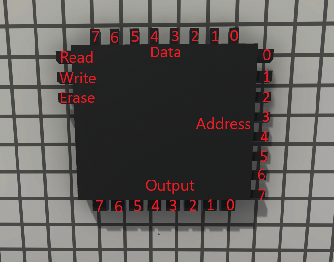

# Memory
This LogicWorld mod gives you a brand new memory component. With this you can store Data for computers or other things even on world reload. Im planning to make a script that can write the memory outside the game so you can upload your own data to it.

## Storages
Currently there is only 1 Storage with the following specs:
| Name | Value |
| - | - |
| Address Size | Byte |
| Data Size | Byte |

This is the pinout for this model

Im planning to add more but for now im too lazy

## Installing this Mod
To install mods, just drag and drop the `Memory` folder inside your `/path/to/LogicWorld/GameData/` folder and you are ready to enjoy the mod!

## Other Mods
You can see my other creations [here](https://github.com/fluffeliger/Logicworld-Mods).